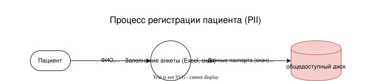
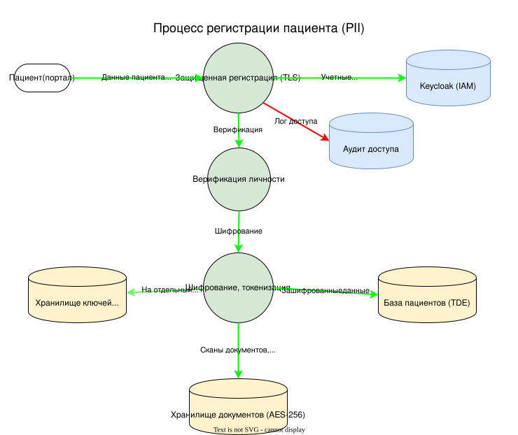
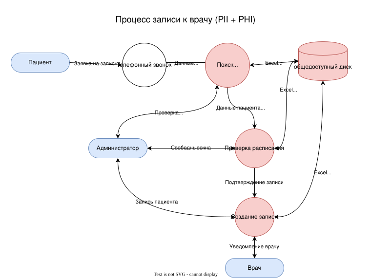
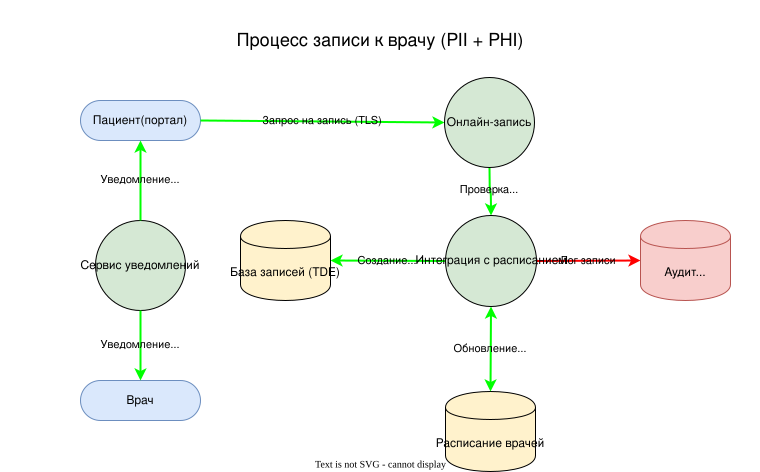
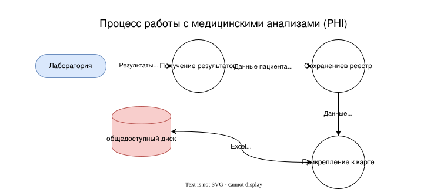
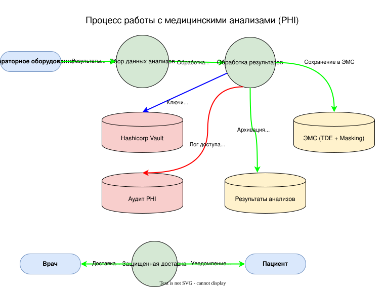
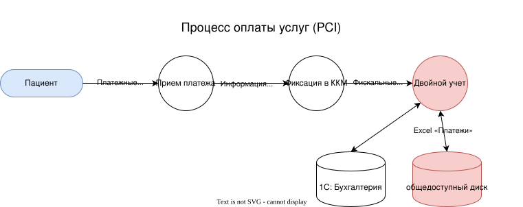
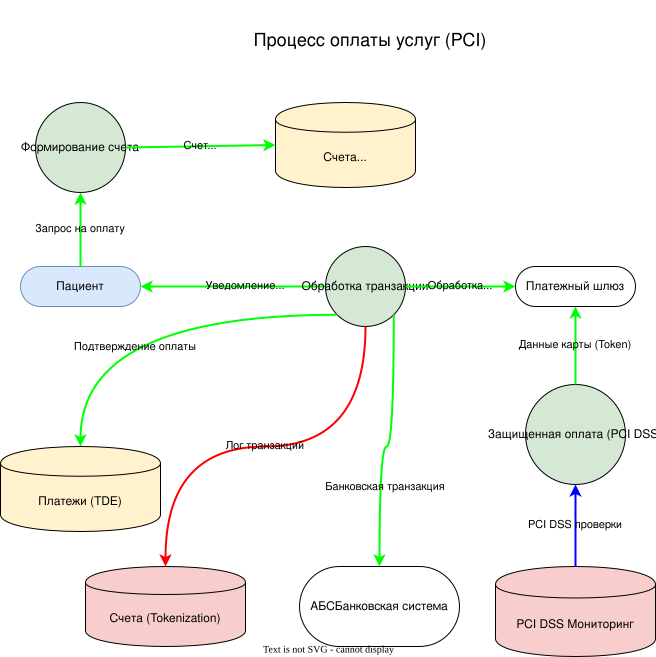

# Задание 1. Анализ безопасности системы

- [Аудит](./readme-audit.md)
- [Сценарии утечек](readme-dataleaking.md)
- [Предложения](./readme-suggest.md)

Далее привожу последовательность DFD (сначала AS-IS, потом TO-BE)

---

## DFD 1

---

## DFD 2

---

## DFD 3

---

## DFD 4

---
