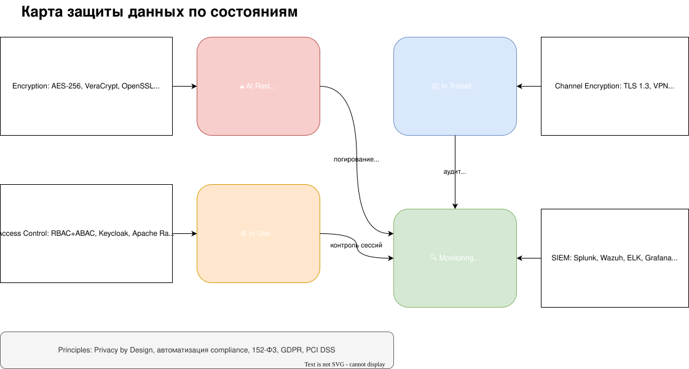

# Задание 3. Оценка Data Encryption at Rest and In Transit

## **1. Классификация данных**

Для построения эффективной модели защиты данные категоризируются по трём ключевым параметрам:

- **Состояние**: данные в хранилище (at rest), в передаче (in transit), в обработке (in use).
- **Чувствительность**: ПДн, медицинские данные, финансовая информация, служебные данные.
- **Профиль риска**: высокий, средний, низкий (оценивается по потенциальному ущербу при инциденте).

> Примечание: оцениваем с точки зрения конечных пользователей (клиентов). Однако риск утраты учётных данных сотрудников так же велик.

| **Категория данных**                                   | **Примеры**                                                    | **Чувствительность** | **Профиль риска** | **Состояние** |
| --------------------------------------------------------------------------- | --------------------------------------------------------------------------- | ------------------------------------------ | ----------------------------------- | ---------------------------- |
| **Персональные данные (ПДн)**                    | ФИО, телефон, email, паспортные данные            | Высокая                             | Высокий                      | At rest, in transit          |
| **Медицинские данные**                               | Диагнозы, истории болезней, анализы           | Критическая                     | Высокий                      | At rest, in use              |
| **Финансовые данные**                                 | Платежи, реквизиты, бухгалтерские отчёты | Высокая                             | Высокий                      | At rest, in transit          |
| **Учётные записи сотрудников**                | Логины, пароли, роли доступа                         | Средняя                             | Средний                      | At rest, in transit          |
| **Товарно-материальные ценности (ТМЦ)** | Оборудование, лекарства, закупки                | Низкая                               | Низкий                        | At rest                      |
| **Аналитические данные**                           | Статистика посещений, ABC-анализ                   | Средняя                             | Средний                      | At rest, in use              |

## **2. Обоснование необходимости защиты**

| **Тип данных**                           | **Риски без защиты**                                                                        | **Требования регуляторов**                                                   |
| ------------------------------------------------------- | --------------------------------------------------------------------------------------------------------------- | ------------------------------------------------------------------------------------------------------- |
| **ПДн и медицинские данные** | Утечки => штрафы,  репутационный ущерб,  судебные иски | 152-ФЗ, GDPR, HIPAA (при работе с  иностранными пациентами) |
| **Финансовые данные**             | Мошенничество, блокировка счетов                                                   | PCI DSS, 115-ФЗ (ПОД/ФТ)                                                                         |
| **Учётные записи**                   | Несанкционированный доступ к медкартам                                       | Требования ФСТЭК, ФСБ (для госучреждений)                             |
| **ТМЦ**                                        | Кражи, неучтённые списания                                                               | Внутренние политики компании                                                  |
| **Аналитика**                            | Деанонимизация, утечка косвенных ПДн                                            | Внутренние compliance-политики                                                        |

## **3. Инструменты защиты данных по состояниям**

## **4. Автоматизированный контроль**

- **DLP (Data Loss Prevention)**:
  - **Symantec DLP** или **Digital Guardian** — блокировка передачи ПДн вне контура системы.
- **Управление ключами шифрования**:
  - **HashiCorp Vault** или **AWS KMS** — централизованная ротация и безопасное хранение ключей.
- **Аудит действий**:
  - **ELK-стек** (Elasticsearch + Kibana) — агрегация и анализ логов.
  - **Victoria Metrics** **+ Victoria Logs**
  - **Apache Atlas** — отслеживание lineage данных (кто, когда и к какой информации обращался).

## **5. Реестр программных и аппаратных средств**

| **Категория**                         | **Программные решения**                                                                                                                                                               | **Аппаратные решения** |
| ---------------------------------------------------- | ------------------------------------------------------------------------------------------------------------------------------------------------------------------------------------------------------------- | --------------------------------------------- |
| **Шифрование**                       | VeraCrypt, OpenSSL, HashiCorp Vault                                                                                                                                                                           | HSM-модули (Thales, YubiHSM)            |
| **Контроль доступа**            | Keycloak, Apache Ranger                                                                                                                                                                                       | Смарт-карты для 2FA              |
| **Мониторинг**                       | Wazuh, Splunk, Grafana                                                                                                                                                                                        | Выделенные хосты для SIEM   |
| **Анонимизация**                   | ARX, Gretel.ai                                                                                                                                                                                                | —                                            |
| **Резервное копирование**  | Bacula, Veeam                                                                                                                                                                                                 | Ленточные библиотеки (LTO) |
| Обфускаторы или компиьяторы | В зависимости от языка, обфускатор. Создание binary сборок,  которые сложно подвергнуть  реверсинжинирингу |                                               |

## **Итоговая архитектура защиты данных**

1. **Шифрование на всех этапах**:
   - **At rest**: AES-256 для БД (Postgres), шифрование файлов (VeraCrypt).
   - **In transit**: TLS 1.3 для веб-портала, VPN для межфилиальной связи.
2. **Строгий контроль доступа**:
   - Медики видят только своих пациентов,
   - Бухгалтеры — только финансовые данные (принцип наименьших привилегий).
3. **Аудит и прозрачность**:
   - Пациент может запросить отчёт о доступе к своим данным через **Patient Portal**.
4. **Автоматизация compliance**:
   - Интеграция **Apache Atlas** с регуляторными требованиями для автоматических проверок.
5. **Минимизация данных**:
   - Запрашиваем, храним и передаём только то что необходимо для выполнения задачи. Не запрашиваем лишних данных от пользователя. При утечке данных приведёт к минимизации последствий и судебных издержек.
